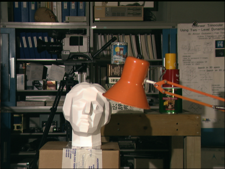
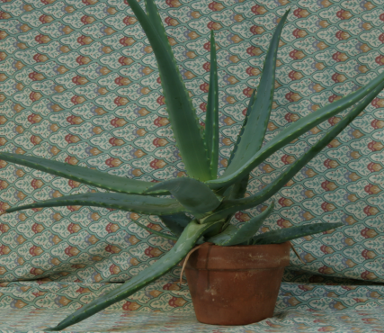

# Calculate Disparity Map with distance (L1, L2, Cosine Similarity)


$$\text{l1 (Absolute Difference )} L1 (\vec{a}, \vec{b}) = \sum_{i=1}^N {|a-b|}$$

$$\text{l2 (Mean Square Error )} L2 (\vec{a}, \vec{b}) = \sqrt{\sum_{i=1}^N {(a-b)^2}}$$

$$\text{cosine similarity }(\vec{a}, \vec{b}) = \frac{a \cdot b}{||a|| ||b||} = \frac{\sum_{i=1}^N(a_ib_i)}{\sqrt{\sum_{i=1}^N a_i ^2} \sqrt{\sum_{i=1}^N b_i ^2}}$$
# How to run 
* Clone this repository
```bash
git clone https://github.com/VayneMai020301/Image-Depth-Estimation.git
```
* Environment Configuration
```bash
pip install stream-lit
```
# Based on Pixel-wise matching method 
### Step to Step 
1. Read the left image and right image as grayscale images, and simultaneously cast the image type to np.float32.
```python
left_image = cv2.imread(path_left_image, 0) 
right_image = cv2.imread(right_left_image, 0) 

left_image = left_image.astype(np.float32 )
right_image = right_image.astype(np.float32 )

```
2. Initialize two variables, height and width, with values equal to the height and width of the left image.
```python 
height , width = left_image.shape[:2] 
or height , width = right_image.shape[:2]
```
3. Initialize a zero matrix (depth) with dimensions equal to height and width.
```python 
depth = np.zeros((height , width ), np.uint8 )
```
4. For each pixel at position (h, w) (iterating from left to right, top to bottom), perform the following steps:

__(a)__ Calculate the cost (L1 or L2) between the pixel pairs left[h, w] and right[h, w - d] (where d ∈ [0, disparity_range]). If (w - d) < 0, assign the value cost = max_cost (max_cost = 255 if using L1 or 255^2 if using L2).
```python 
cost = 255
for j in range( disparity_range ) :
    cost = max_value if (x - j) < 0 else distance_l1 (int(left [y, x]) ,int (right [y, x - j]))
    
```
__(b)__ From the list of computed costs, choose the value d (doptimal) that gives the smallest cost.
```python
if cost < cost_min :
        cost_min = cost
        disparity = j
```
__(ca)__ Assign depth[h, w] = doptimal × scale, where scale = 255 / disparity_range.
```python
depth [y, x] = disparity * scale
```


# Based on Window-base matching method 
### Step to Step 
#### 1. Read the left and right images as grayscale images and simultaneously cast their type to np.float32.
```python 
left_image = cv2.imread(path_left_image, 0) 
right_image = cv2.imread(right_left_image, 0) 

left_image = left_image.astype(np.float32 )
right_image = right_image.astype(np.float32 )
```

#### 2. Initialize two variables, height and width, with values equal to the height and width of the left image.
```python 
height , width = left_image.shape[:2] 
or height , width = right_image.shape[:2]
```

#### 3. Initialize a zero matrix (depth) with dimensions equal to height and width.
```python 
depth = np.zeros ((height , width ) , np.uint8 )
```

#### 4. Calculate the half-size of the window from its center to the edge using the formula kernel_half = (k−1) // 2.

For each pixel at position (h, w) (where h ∈ [kernel_half, height - kernel_half] and w ∈ [kernel_half, width - kernel_half]; iterating from left to right, top to bottom), perform the following steps:

* __(a)__ Calculate the sum of costs (L1 or L2) between the pixel pairs left[h + v, w + u] and right[h + v, w + u - d] (where d ∈ [0, disparity_range] and u, v ∈ [-kernel_half, kernel_half]) within the window centered at the current pixel position. If (w + u - d) < 0, assign the cost value of the current pixel pair to max_cost (max_cost = 255 if using L1 or 255^2 if using L2).
```python
for j in range(disparity_range ) :
    d = x - j
    cost = -1
    if (d - kernel_half ) > 0:
        wp = left [(y- kernel_half ) :(y+ kernel_half ) +1 , (x-kernel_half ) :(x+ kernel_half ) +1]
        wqd = right [(y- kernel_half ) :(y+ kernel_half ) +1 , (d-kernel_half ) :(d+ kernel_half ) +1]
        wp_flattened = wp.flatten()
        wqd_flattened = wqd.flatten()
        cost = cosine_similarity(wp_flattened, wqd_flattened)
```
* __(b)__ From the list of computed costs, choose the value d (doptimal) that gives the smallest total cost.
```python
if cost > cost_optimal :
    cost_optimal = cost
    disparity = j
```
* __(c)__ Assign depth[h, w] = doptimal × scale, where scale = 255 / disparity_range.
```python
depth [y, x] = disparity * scale
```

# Results
### Pixel-wise matching 
* Left and Right Image 

<div style="display: flex; justify-content: center; align-items: center;">
   <div style="text-align: center; margin: 10px;">
    
    <p>Left Image</p>
  </div>
  <div style="text-align: center; margin: 10px;">
    
    <p>Right Image</p>
  </div>
</div>
<div style="display: flex; justify-content: center; align-items: center;">
   <div style="text-align: center; margin: 10px;">
    
    <p>Pixel-wise matching l1</p>
  </div>
  <div style="text-align: center; margin: 10px;">
    
    <p>Pixel-wise matching l1 color</p>
  </div>
</div>
<div style="display: flex; justify-content: center; align-items: center;">
 <div style="text-align: center; margin: 10px;">
    
    <p>Pixel-wise matching l2</p>
  </div>
  <div style="text-align: center; margin: 10px;">
    
    <p>Pixel-wise matching l2</p>
  </div>
</div>

* Left and Right Image 
<div style="display: flex; justify-content: center; align-items: center;">
   <div style="text-align: center; margin: 10px;">
    
    <p>Left Image</p>
  </div>
  <div style="text-align: center; margin: 10px;">
    
    <p>Right Image</p>
  </div>
</div>

<div style="display: flex; justify-content: center; align-items: center;">
   <div style="text-align: center; margin: 10px;">
    
    <p>Window-base matching l1</p>
  </div>
  <div style="text-align: center; margin: 10px;">
    
    <p>Window-base matching l1 color</p>
  </div>
</div>

<div style="display: flex; justify-content: center; align-items: center;">
  <div style="text-align: center; margin: 10px;">
    
    <p>Window-base matching l2</p>
  </div>
  <div style="text-align: center; margin: 10px;">
    
    <p>Window-base matching l2 color</p>
  </div>
</div>

<div style="display: flex; justify-content: center; align-items: center;">
  <div style="text-align: center; margin: 10px;">
    
    <p>Window-base matching cosine similarity</p>
  </div>
  <div style="text-align: center; margin: 10px;">
    
    <p>Window-base matching cosine similarity color</p>
  </div>
</div>

# Deploy Stream Lit 
* How to run 
```python 
python streamlit run app.py
```
<div style="display: flex; justify-content: center; align-items: center;">
  <div style="text-align: center; margin: 10px;">
    
  </div>
</div>

<div style="display: flex; justify-content: center; align-items: center;">
  <div style="text-align: center; margin: 10px;">
    
  </div>
</div>
